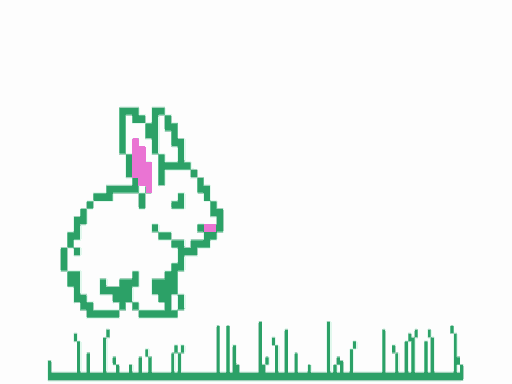

# bunny

A Color Computer 1/2 demo: a white LPC-style bunny on a white CG3 screen
(128x96, 4 colors) with cyan grass. It sits, wiggles its nose, hops over to
a carrot, eats it, yawns, falls asleep, wakes up and hops back home, with
sound effects playing while it animates.



Written in Forth using the kernel and cross-compiler from the coco project.

## The show

One loop takes about 15 seconds and repeats forever:

1. Sits for a random moment, then wiggles its nose (sniff).
2. Hops right (boing).
3. A carrot appears; the bunny eats it in three bites (crunch), stepping
   closer after each one until only the greens are left.
4. Yawns, dozes off and snores while a z floats up.
5. Wakes (chirp), wiggles its nose, turns around and hops back to the start.

Press BREAK to return to BASIC.

## Requirements

- A checkout of the coco project (https://github.com/ugufru/coco) at
  `~/github/coco` (or set `COCO=...`). Tested with coco commit `b5158e6`.
- `lwasm` (to build the kernel if it isn't built yet)
- Python 3 with Pillow (sprite converter)
- XRoar with `bas12.rom` and `extbas11.rom` in `~/.xroar/roms/`

## Build and run

```sh
make                  # builds bunny.bin
make run              # launches XRoar (32K CoCo 2)
make preview          # opens build/preview.png, every sprite frame at 4x
make shot SHOT_AT=240 # headless: renders screen memory at main loop pass 240
                      # to build/shot.png
make cycles           # fc.py cycle estimates per word
make issues           # rebuilds issues.html from issues.jsonl and roadmap.jsonl
make clean
```

## How it fits together

- `bunny.fs`: the demo. A 2x opaque blitter and rect clear in 6809 assembly,
  a frame-table animation player with events, and sound from coco's
  `lib/async-sound.fs`.
- `tools/png2cg.py` reads `tools/frames.json` and writes `build/sprites.fs`:
  2bpp sprite records, left-facing mirrored copies, the animation script,
  the grass strip and the pixel-doubling table.
- `tools/frames.json`: crop boxes into the sheet, color mapping, and the whole
  show as data. Each animation entry is frame, dx, dy, hold and an event id
  (boing, bite, carrot, z, sniff, chirp and so on); sub-animations are spliced
  in with `"@name"`.
- `assets/bunnysheet5.png`: the original sprite sheet.
- `assets/extra/*.txt`: hand-drawn ASCII pixel frames (nose wiggle, yawn,
  sleep, carrot stages, z).
- `tools/cg3shot.py`: renders a CG3 page from an XRoar RAM dump (used by
  `make shot`).
- `PLAN.md`: the original design notes.
- `issues.jsonl`, `roadmap.jsonl`, `issues.html`: work tracking.
- `CREDITS.md`: art attribution and licenses.

## License

The code (Forth, assembly, Python tools, Makefile) is under the BSD 2-Clause
license in `LICENSE`, the same license as the coco project.

The art is not: the bunny sprite sheet and the frames derived from it
(`assets/`, `screenshot.png`, `bunny.gif`, `bunny.mov`, and the sprite data
generated from them) are under CC-BY-SA 3.0. See `CREDITS.md`.

## Credits

Bunny art: "Bunny Rabbit LPC Style for PixelFarm" by Stephen 'Redshrike'
Challener, commissioned for PixelFarm, CC-BY 3.0 / CC-BY-SA 3.0 / OGA-BY 3.0.
See `CREDITS.md`.
